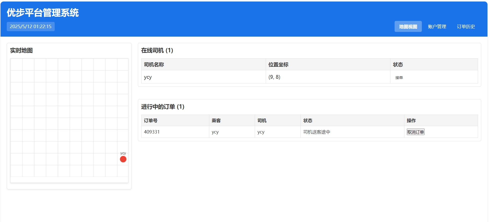
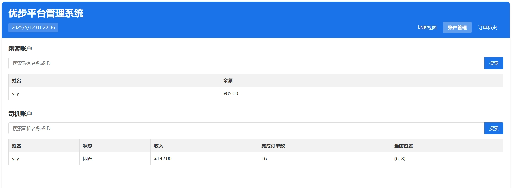
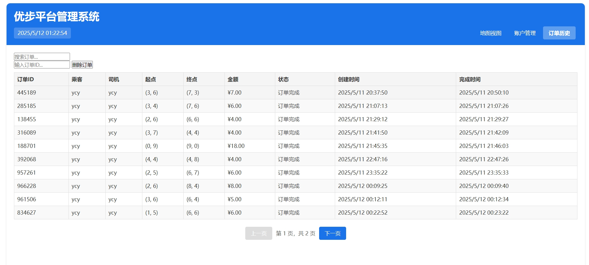
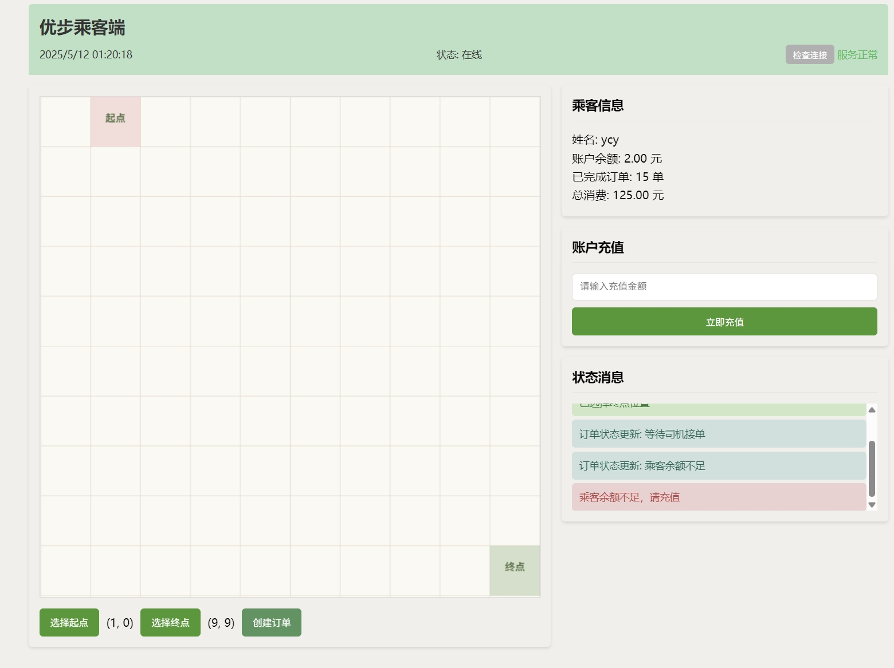
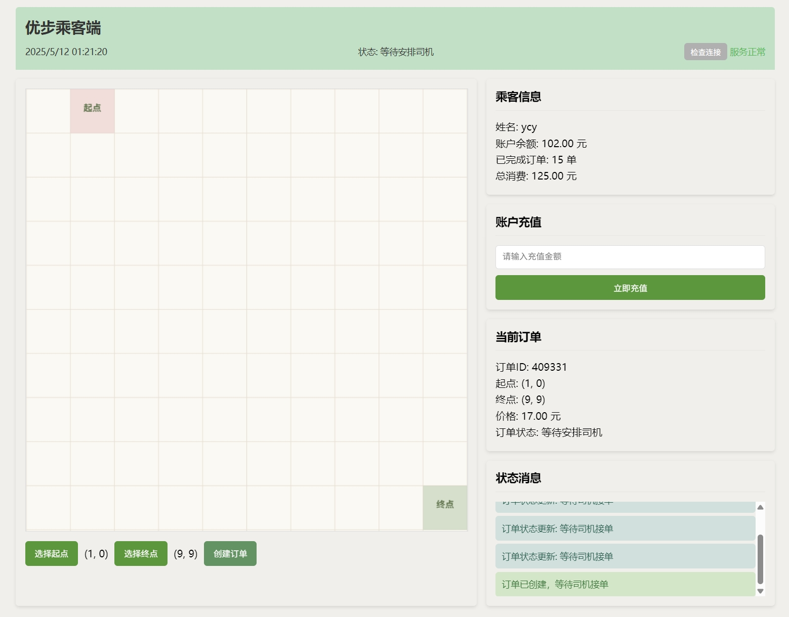
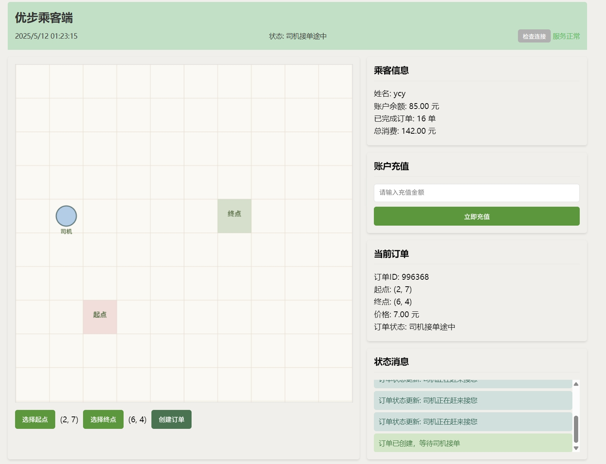
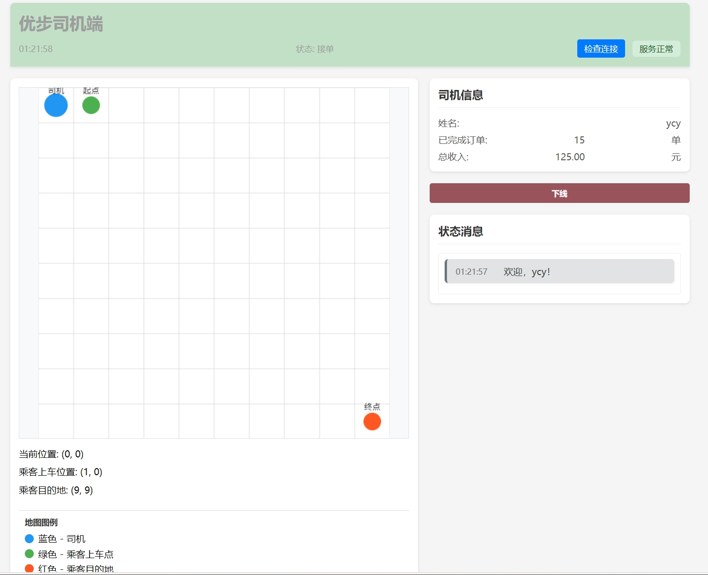

# Uber任务

## 项目概述

本项目是一个模拟Uber打车平台的分布式系统，由三个主要服务组成：平台服务(Platform)、乘客服务(Passenger)和司机服务(Driver)。系统采用微服务架构，使用Spring Cloud构建。

## 演示视频

[点击这里查看演示视频](./resources/demo.mp4)

## 系统架构

系统由以下几个主要组件构成：

1. **平台服务(Platform)**：核心服务，负责订单管理、司机派遣、用户账户管理等业务逻辑。
2. **乘客服务(Passenger)**：为乘客提供接口，包括登录、发起订单、充值等功能。
3. **司机服务(Driver)**：为司机提供接口，包括登录、接单等功能。

## 技术栈

- **后端**：Spring Boot 3.2.3, Spring Cloud 2023.0.0
- **微服务注册与发现**：Netflix Eureka
- **API文档**：SpringDoc OpenAPI (Swagger) 2.3.0
- **数据库**：H2 (内存数据库)
- **前端**：HTML, CSS, JavaScript
- **实时通信**：WebSocket
- **测试**：JUnit 5

## 功能特性

### 平台服务功能
- 实时位置跟踪
  
- 用户(乘客/司机)账户管理
  
- 历史订单管理
  
- 司机派遣算法
- 账单生成与结算

### 乘客服务功能
- 乘客账号登录
- 创建打车订单与账户充值
  
  
- 订单状态实时更新
- 实时显示司机位置
  

### 司机服务功能

- 司机账号登录
- 接收订单分配
  
- 实时位置更新
- 订单状态更新
- 订单取消通知
- 收入统计

## API文档

各服务的API文档可通过Swagger UI访问：

- 乘客服务：http://localhost:8081/swagger-ui.html
- 司机服务：http://localhost:8082/swagger-ui.html
- 平台服务：http://localhost:8083/swagger-ui.html

## 前端界面

系统提供了三个不同的前端界面：

1. **平台管理界面**：
   - 实时地图显示在线司机和活动订单
   - 账户管理（乘客/司机）
   - 订单历史记录

2. **乘客应用界面**：
   - 账户信息与充值
   - 选择起点和终点
   - 创建订单
   - 实时追踪司机位置

3. **司机应用界面**：
   - 司机状态管理
   - 接收订单通知
   - 导航到乘客位置和目的地
   - 订单完成和收入查看

访问前端界面：
   - 乘客应用界面：http://localhost:8081
   - 司机应用界面：http://localhost:8082
   - 平台管理界面：http://localhost:8083

## 运行说明

### 前置条件

- JDK 17或更高版本
- Gradle 7.6或更高版本

### 自动启动（推荐）

项目提供了Windows环境下的自动启动脚本，可以一键启动所有服务并打开前端界面：

1. 在项目根目录下，双击运行 `start_services.bat`
2. 脚本会按以下顺序自动完成所有操作：
   - 编译所有服务（Eureka, API Gateway, Platform, Driver, Passenger）
   - 按正确顺序启动所有服务
   - 自动打开三个前端界面
   - 在logs目录下保存所有服务的日志

## 单元测试

项目包含全面的单元测试，涵盖了关键业务逻辑和服务功能。测试用例设计遵循以下原则：

- 服务层逻辑测试
- 控制器接口测试
- 模型验证测试
- WebSocket消息测试

## 项目特点

1. **分布式架构**：服务解耦，独立扩展
2. **实时通信**：使用WebSocket实现实时位置更新和订单状态通知
3. **模拟现实场景**：司机自动导航、计费、订单状态流转等
4. **完整的业务流程**：从下单、派单、接乘客到送达目的地的完整流程
5. **全面的测试覆盖**：单元测试和集成测试保证系统稳定性
